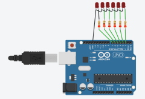

# Pertemuan-2 Percabangan & Perulangan
## Pertanyaan 1.5 Percabangan
1. Pada kondisi apa program masuk ke blok if?
    * Jawab : Ketika LED berkedip sangat cepat dan timeDelay mencapai nilai kurang dari 100 ms
2. Pada kondisi apa program masuk ke blok else?
    * Jawab : Ketika LED berkedip dengan normal diatas 100 ms
3. Apa fungsi dari perintah delay(timeDelay)?
    * Jawab : delay(timeDElay) memberikan jeda berhenti selama variabel timeDelay sebelum menjalankan perintah selanjutnya
4. Jika program yang dibuat memiliki alur mati → lambat → cepat → reset (mati), ubah menjadi LED tidak langsung reset → tetapi berubah dari cepat → sedang → mati dan berikan penjelasan disetiap baris kode nya
    * Jawab : 
```cpp
const int ledPin = 6; 
int timeDelay = 1000;
int step = -100; // step perubahan delay

void setup() {
    pinMode(ledPin, OUTPUT);
}

void loop() {
    digitalWrite(ledPin, HIGH);
    delay(timeDelay);
    
    digitalWrite(ledPin, LOW);
    delay(timeDelay);
    
    timeDelay += step; // timeDelay dijumlahkan dengan step untuk mengubah delay

    if (timeDelay <= 100) {
        step = 100; // ketika mencapai timeDelay 100, step diubah menjadi positif untuk meningkatkan delay
    } 

    if (step == 100 && timeDelay >= 700) {
        digitalWrite(ledPin, LOW); // ketika timeDelay sedang, LED reset(mati)
        delay(3000);
        step = -100; // ketika mencapai timeDelay 700, step diubah menjadi negatif untuk menurunkan delay
        timeDelay = 1000; // timeDelay menjadi lambat seperti semula
    }
}
```
## Pertanyaan 1.6 Perulangan
1. Gambarkan rangkaian schematic 5 LED running yang digunakan pada percobaan!
    * Jawab : 
2. Jelaskan bagaimana program membuat efek LED berjalan dari kiri ke kanan!
    * Jawab : dengan for loop pertama bergantian menyalakan dan mematikan led pin 2-7 bergantian
3. Jelaskan bagaimana program membuat LED kembali dari kanan ke kiri!
    * Jawab : dengan for loop kedua bergantian menyalakan dan mematikan led pin 7-2 bergantian
4. Buatkan program agar LED menyala tiga LED kanan dan tiga LED kiri secara bergantian dan berikan penjelasan disetiap baris kode nya!
    * Jawab :
    ```cpp
    int timer = 500;           
    void setup() { 

    output: 
    for (int ledPin = 2; ledPin < 8; ledPin++) { 
        pinMode(ledPin, OUTPUT); 
    } 
    } 
    void loop() { 
    for (int i = 2; i <= 4; i++) { 
        digitalWrite(i, HIGH);      // indeks i(2,3,4) sebagai ledPin akan menyala
        digitalWrite(i + 3, LOW);   // indeks i+3(5,6,7) sebagai ledPin akan mati
    } 
    delay(timer); 

    for (int i = 2; i <= 4; i++) { 
        digitalWrite(i, LOW);       // indeks i(2,3,4) sebagai ledPin akan mati
        digitalWrite(i + 3, HIGH);  // indeks i+3(5,6,7) sebagai ledPin akan menyala
    } 
    delay(timer); 
    } 
    ```